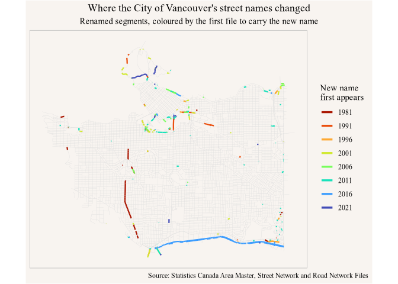

<!-- Generated from vignettes.orig/canstreet-renames.Rmd -- do not edit. -->
<!-- Rebuild with: Rscript vignettes.orig/precompute.R -->


`build_temporal_network()` answers when a road was first and last mapped. The
crosswalk it writes alongside answers a different question: what the road was
*called* in each of those years. Sequencing those names and diffing them finds
renamings --- but most of what the diff returns is not a road changing its name,
it is Statistics Canada changing how it writes one. This vignette peels those
layers off in order, over one city, until what is left is worth reading.


``` r
library(canstreet)
library(dplyr)
#> 
#> Attaching package: 'dplyr'
#> The following objects are masked from 'package:stats':
#> 
#>     filter, lag
#> The following objects are masked from 'package:base':
#> 
#>     intersect, setdiff, setequal, union
library(ggplot2)
```

## The region

Build over the CMA and read over the city. The build needs the wider region ---
sources are staged against the area buffered outward, so a road at the city
limit still has its counterpart to match against --- but the naming conventions
worth reading are one municipality's, and forty-five years of a single street
grid is a small enough corpus to check by eye.


``` r
cma <- cancensus::get_statcan_geographies("2021", level = "CMA", type = "digital") |>
  filter(CMANAME == "Vancouver")

van_city <- cancensus::get_statcan_geographies("2021", level = "CSD", type = "digital") |>
  filter(CSDUID == "5915022")

vancouver_crs <- "+proj=lcc +lat_1=49.0000658247404 +lat_2=49.5742753405107 +lat_0=49.2871705826255 +lon_0=-123.073508713002 +x_0=0 +y_0=0 +ellps=GRS80 +datum=NAD83 +units=m +no_defs"

vancouver <- build_temporal_network(
  "vancouver", c(1976, 1981, 1991, 1996, 2001, 2006, 2011, 2016, 2021),
  within = cma, region_note = "2021 CMA boundary, Vancouver (933)")

city <- get_temporal_network("vancouver", within = van_city) |>
  select(segment_id, first_year, len_m) |>
  collect()

sources <- get_temporal_network_sources("vancouver")
```

The subset is by polygon, not by attribute: `csduid_l` on a segment comes from
the vintage its geometry was cut from, and the 1976--2006 files carry no region
columns, so an attribute filter would drop exactly the oldest segments.

## Each year holds its own name

A crosswalk row is one segment in one year, and `src_name` is what *that year's*
file called it --- not what the newest year calls it, which is the `name` on the
segment itself. So a segment that was renamed carries the whole sequence:


``` r
sources |>
  filter(segment_id == 67618) |>
  select(vintage, src_name, match_kind, dist_m, source_file) |>
  collect() |>
  arrange(vintage)
#> # A tibble: 9 × 5
#>   vintage src_name   match_kind       dist_m source_file       
#>     <int> <chr>      <chr>             <dbl> <chr>             
#> 1    1976 KENT       geometry      19.9      vancouver.data    
#> 2    1981 KENT       geometry      21.5      vancouver.data    
#> 3    1991 KENT       geometry       6.82     NET_VACI.E00      
#> 4    1996 NORTH KENT geometry       6.82     GSNF933R.E00      
#> 5    2001 Kent       geometry       0.354    grnf000r02ml_e.MIF
#> 6    2006 Kent       geometry       0.355    grnf000r06a_e.shp 
#> 7    2011 Kent       geometry       0.0153   grnf000r11a_e.shp 
#> 8    2016 E Kent     geometry+name  0.000380 lrnf000r16a_e.shp 
#> 9    2021 E Kent     spine          0        lrnf000r21a_e.shp
```

That is a block of Kent Avenue on the Fraser, called `KENT` for thirty-five
years, `NORTH KENT` in 1996 alone, and `E Kent` from 2016 on.

Two things to read off it. `source_file` is part of the identity, not
decoration: the Area Master and Street Network Files number each source file
from scratch, so it takes `(source_file, source_id)` to name an arc of a given
year.

And `match_kind` is `geometry` on every row up to 2016. `spine` is the year the
geometry came from, `geometry+name` is a match where the two files agreed on the
name, and **`geometry` is a match where they did not** --- the arcs sit within
the calibrated tolerance and run the same way, but are named differently. That
is the rename signal, and it is the only one there is: the name rescue joins on
exact name equality, so by construction it can never match across a rename.

## Sequencing the names

Order each segment's rows by year, fold the names the way the matcher folds
them, and compare each with the one before it. `strip_accents` and
`regexp_replace` are DuckDB's, so the fold is computed in the database and is
the same rule the build used:


``` r
steps <- sources |>
  mutate(nm = regexp_replace(strip_accents(toupper(src_name)),
                             '^([0-9]+)(ST|ND|RD|TH)$', '\\1')) |>
  select(segment_id, vintage, src_name, nm, dist_m) |>
  collect() |>
  filter(segment_id %in% city$segment_id) |>
  arrange(segment_id, vintage) |>
  group_by(segment_id) |>
  mutate(prev_name = lag(src_name), prev_nm = lag(nm),
         prev_year = lag(vintage), prev_dist = lag(dist_m)) |>
  ungroup() |>
  filter(!is.na(prev_name)) |>
  left_join(city |> select(segment_id, len_m), by = "segment_id")

filled <- function(x) !is.na(x) & nzchar(x)

raw    <- coalesce(steps$prev_name, "") != coalesce(steps$src_name, "")
folded <- raw & coalesce(steps$prev_nm, "") != coalesce(steps$nm, "")
named  <- folded & filled(steps$prev_nm) & filled(steps$nm)

funnel <- function(step, keep) {
  tibble::tibble(step = step, segments = sum(keep),
                 km = round(sum(steps$len_m[keep]) / 1000, 1))
}

bind_rows(
  funnel("written differently", raw),
  funnel("... and differ after folding", folded),
  funnel("... and neither side is blank", named))
#> # A tibble: 3 × 3
#>   step                          segments    km
#>   <chr>                            <int> <dbl>
#> 1 written differently              16096 1803 
#> 2 ... and differ after folding      3239  274.
#> 3 ... and neither side is blank     2930  251
```

Most of the raw churn is case, accents and the numbered street the files respell
at 2001 --- 1996 writes `MARINE` and `15`, 2001 writes `Marine` and `15th` ---
all of which the matcher already folds away. The blank-sided rows are roads that
gained or lost a name, which is a different event, so they go too.


``` r
changes <- steps |> filter(named) |> rename(from = prev_nm, to = nm)
```

## The street type moved out of the name

The largest single pattern left is a street type appearing or disappearing at
the end of a name. The older files often write the type into the name field as
well as into `type`, and later ones stop. Because the crosswalk carries
`source_file` beside `source_id`, the two source records can be read back
directly and the claim checked rather than assumed:


``` r
with_type <- function(year, nm) {
  sources |>
    filter(vintage == year) |>
    inner_join(get_road_network(year, quiet = TRUE) |>
                 select(source_file, source_id, type),
               by = c("source_file", "source_id")) |>
    filter(src_name == nm) |>
    count(vintage, src_name, type) |>
    collect()
}

bind_rows(with_type(1991, "GRANDVIEW HIGHWAY"), with_type(1996, "GRANDVIEW"),
          with_type(1981, "EAST BOULEVARD"),    with_type(1991, "EAST"))
#> # A tibble: 6 × 4
#>   vintage src_name          type      n
#>     <int> <chr>             <chr> <dbl>
#> 1    1991 GRANDVIEW HIGHWAY HY       37
#> 2    1996 GRANDVIEW         HY       48
#> 3    1981 EAST BOULEVARD    CR       35
#> 4    1991 EAST              RD       16
#> 5    1991 EAST              CT        2
#> 6    1991 EAST              BV       35
```

1991 writes Grandview Highway's type twice, once spelled out in `name` and once
as `HY` in `type`; 1996 keeps only the second. East Boulevard in Kerrisdale is
the same move a decade earlier, `BOULEVARD` in the name giving way to `BV` in
`type`. Same road, different filing.

## Peeling off the conventions

Three rules take out the rest of the changes that are about spelling rather than
naming. A deeper normalization that also ignores spacing, punctuation,
spelled-out numbers and `NO.` prefixes (`SOUTH RIDGE`/`SOUTHRIDGE`,
`133 A`/`133A`, `TENTH`/`10th`, `NO. 5`/`5`), and with it the Street Network
File's fixed-width name field, which truncates at twenty characters
(`COLUMBIA QUEBEC CONN`/`COLUMBIA QUEBEC CON.`); the trailing street-type word
above; and a distance cut, because a match 30 m away under a 38 m tolerance is
about as likely to be the next street over as the same one.


``` r
spelled <- c(ZERO = 0, FIRST = 1, SECOND = 2, THIRD = 3, FOURTH = 4, FIFTH = 5,
             SIXTH = 6, SEVENTH = 7, EIGHTH = 8, NINTH = 9, TENTH = 10,
             ELEVENTH = 11, TWELFTH = 12)

deep <- function(x) {
  y <- gsub("\\bNO\\.? ", "", x)
  for (w in names(spelled)) y <- gsub(paste0("\\b", w, "\\b"), spelled[[w]], y)
  y <- gsub("\\b([0-9]+)(ST|ND|RD|TH)\\b", "\\1", y)
  gsub("[^A-Z0-9]", "", y)
}

# One name is the other cut short: the SNF name field is twenty characters wide.
clipped <- function(a, b) {
  k <- pmin(nchar(a), nchar(b))
  k >= 15 & substr(a, 1, k) == substr(b, 1, k)
}

types <- c("HIGHWAY", "HWY", "FREEWAY", "FRWY", "ROAD", "RD", "STREET", "ST",
           "AVENUE", "AVE", "DRIVE", "DR", "WAY", "BOULEVARD", "BLVD",
           "PARKWAY", "PKWY", "PKY", "CRESCENT", "CRES", "PLACE", "PL", "LANE",
           "LN", "COURT", "CRT", "CT", "TRAIL", "BRIDGE", "CAUSEWAY", "VIADUCT",
           "DIVERSION", "BYPASS", "BY-PASS", "MALL", "WALK", "WYND", "SQUARE",
           "ALLEY", "CONNECTOR", "THRUWAY", "EXPRESSWAY", "ROUTE", "DRIVEWAY")

# The one word a name has that the other does not, when that is the only change.
odd_word <- function(a, b) {
  mapply(function(x, y)
           if (length(x) == length(y) + 1L && identical(x[seq_along(y)], y))
             x[length(x)] else NA_character_,
         strsplit(a, " ", fixed = TRUE), strsplit(b, " ", fixed = TRUE),
         USE.NAMES = FALSE)
}

changes <- changes |>
  mutate(word = coalesce(odd_word(from, to), odd_word(to, from)),
         kind = case_when(
           deep(from) == deep(to)          ~ "spelling convention",
           clipped(deep(from), deep(to))   ~ "spelling convention",
           word %in% types                 ~ "street type moved",
           prev_dist >= 10 | dist_m >= 10  ~ "loosely matched",
           TRUE                            ~ "candidate rename"))

changes |>
  group_by(kind) |>
  summarize(segments = n(), km = round(sum(len_m) / 1000, 1)) |>
  arrange(desc(segments))
#> # A tibble: 4 × 3
#>   kind                segments    km
#>   <chr>                  <int> <dbl>
#> 1 loosely matched         1795 143. 
#> 2 candidate rename         698  64.2
#> 3 street type moved        288  30.1
#> 4 spelling convention      149  13.8
```

`loosely matched` is much the largest class here, and it is not a failure of the
files so much as of the question: downtown Vancouver puts named streets within
one tolerance of each other, so a cross-vintage match at 20 m is not evidence
that the two arcs are the same road.

## Names that change back

A name that changes and then changes back is a disagreement between files, not
an event on the ground:


``` r
pairs <- changes |>
  filter(kind == "candidate rename") |>
  group_by(from, to) |>
  summarize(segments = n(), km = round(sum(len_m) / 1000, 2), .groups = "drop")

reversed <- pairs |>
  semi_join(pairs |> select(from = to, to = from), by = c("from", "to"))

nrow(reversed)
#> [1] 80

reversed |> arrange(desc(km)) |> head(8)
#> # A tibble: 8 × 4
#>   from            to         segments    km
#>   <chr>           <chr>         <int> <dbl>
#> 1 KENT            NORTH KENT       32  4.55
#> 2 NORTH KENT      KENT             21  2.31
#> 3 KENT            SOUTH KENT       11  1.35
#> 4 SOUTH KENT      KENT              7  0.99
#> 5 ANDERSON        GRANVILLE        15  0.8 
#> 6 RAMP 003        4                11  0.57
#> 7 GEORGIA VIADUCT DUNSMUIR          4  0.45
#> 8 MARINE          HUDSON            5  0.4
```

`KENT` against `NORTH KENT` and `SOUTH KENT` is 1996 alone using a distinction
its neighbours do not; `ANDERSON` against `GRANVILLE` and `GEORGIA VIADUCT`
against `DUNSMUIR` are the files disagreeing about where one named structure
ends and the next begins.

## What is left


``` r
renames <- pairs |>
  anti_join(reversed, by = c("from", "to")) |>
  arrange(desc(km))

tibble::tibble(pairs = nrow(renames), km = round(sum(renames$km), 1))
#> # A tibble: 1 × 2
#>   pairs    km
#>   <int> <dbl>
#> 1   183  44.7

renames |> head(20)
#> # A tibble: 20 × 4
#>    from                to                  segments    km
#>    <chr>               <chr>                  <int> <dbl>
#>  1 KENT                E KENT                    79 10.5 
#>  2 MAPPLE              EAST BOULEVARD            32  4.11
#>  3 KENT                W KENT                    27  2.46
#>  4 ELLIS               MARINE                     7  1.41
#>  5 LOST LAGOON         N LAGOON                   6  1.05
#>  6 STANLEY PK DRIVEWAY STANLEY PARK               8  0.99
#>  7 CONNAUGHT BRIDGE    CAMBIE BRIDGE              5  0.69
#>  8 GRANDVIEW VIADUCT   TERMINAL                   4  0.69
#>  9 VANCOUVER AQUARIUM  AVISON                    10  0.59
#> 10 COAL HARBOUR        WATERFRONT                 6  0.58
#> 11 6                   CHARLESON                  4  0.57
#> 12 HUDSON              HUDSONARTHUR LAING        10  0.55
#> 13 GEORGIA VIADUCT     PACIFIC                    4  0.54
#> 14 GRANVILLE           99                         7  0.52
#> 15 CASSIAR             TRANS CANADA               4  0.48
#> 16 OAK BRIDGE          OAK STREET BRIDGE          3  0.48
#> 17 PARK DRIVEWAY       STANLEY PK DRIVEWAY        2  0.45
#> 18 OAK STREET BRIDGE   99                         1  0.42
#> 19 HUDSONARTHUR LAING  MARINE                     5  0.4 
#> 20 COAL HARBOUR PROP   COAL HARBOUR               5  0.39
```

Forty-five kilometres over forty-five years, and it reads as a plausible list of
one city's renamings. `KENT` → `E KENT` and `W KENT` is Kent Avenue splitting;
`CONNAUGHT BRIDGE` → `CAMBIE BRIDGE` is the Cambie Street Bridge losing the name
it was opened under; `PARK DRIVEWAY` → `STANLEY PK DRIVEWAY` → `STANLEY PARK`
and `LOST LAGOON` → `N LAGOON` are Stanley Park's internal roads being
renamed twice; `OAK BRIDGE` → `OAK STREET BRIDGE` → `99` and `GRANVILLE` → `99`
are the highway number displacing the street name.

`MAPPLE` → `EAST BOULEVARD` is a Statistics Canada spelling error being fixed,
which is a change to the record rather than to the road. The method cannot tell
those apart and should not pretend to.

## Dating a renaming

The transition columns say *between* which two vintages a name changed, which is
as fine as this data gets:


``` r
kent <- changes |>
  filter(kind == "candidate rename", grepl("KENT", from) | grepl("KENT", to))

kent |> count(prev_year, vintage, from, to, sort = TRUE) |> head(8)
#> # A tibble: 8 × 5
#>   prev_year vintage from       to             n
#>       <int>   <int> <chr>      <chr>      <int>
#> 1      2011    2016 KENT       E KENT        79
#> 2      1991    1996 KENT       NORTH KENT    32
#> 3      2011    2016 KENT       W KENT        26
#> 4      1996    2001 NORTH KENT KENT          20
#> 5      1991    1996 KENT       SOUTH KENT    11
#> 6      1996    2001 SOUTH KENT KENT           7
#> 7      1996    2001 RIVERWOOD  KENT           1
#> 8      1996    2011 NORTH KENT KENT           1
```

The 1996 excursion is one file's; the split into East and West Kent Avenue is a
single event in the 2011--2016 window, 105 segments of it at once. Mapped
against every stable renaming in the city, coloured by the file in which the new
name first appears:


``` r
stable <- changes |>
  filter(kind == "candidate rename") |>
  anti_join(reversed, by = c("from", "to"))

geo <- get_temporal_network("vancouver", within = van_city) |>
  filter(segment_id %in% !!stable$segment_id) |>
  collect_road_network() |>
  inner_join(stable |> select(segment_id, vintage), by = "segment_id") |>
  sf::st_transform(vancouver_crs)

context <- get_temporal_network("vancouver", within = van_city) |>
  filter(list_contains(years, 2021L)) |>
  collect_road_network() |>
  sf::st_transform(vancouver_crs)

ggplot(geo) +
  geom_sf(data = context, colour = "grey86", linewidth = 0.12) +
  geom_sf(aes(colour = factor(vintage)), linewidth = 0.8) +
  scale_colour_viridis_d(option = "turbo", direction = -1,
                         begin = 0.08, end = 0.94) +
  coord_sf(datum = NA) +
  labs(title = "Where the City of Vancouver's street names changed",
       subtitle = "Renamed segments, coloured by the first file to carry the new name",
       colour = "New name\nfirst appears",
       caption = "Source: Statistics Canada Area Master, Street Network and Road Network Files") +
  guides(colour = guide_legend(override.aes = list(linewidth = 1.2)))
```

<div class="figure">

<p class="caption">plot of chunk rename-map</p>
</div>

Renaming is thin, and it clusters: the waterfronts, the bridges and viaducts,
Stanley Park, and the long 2016 run of Kent Avenue along the Fraser.

## What this cannot see

Three limits, in order of how much they cost.

**A road that was renamed *and* redrawn is invisible.** Rule A needs the two
arcs within the calibrated tolerance; rule B needs the names to agree exactly.
A road that fails both is emitted as one segment retiring and another
appearing, with nothing connecting them. That is the systematic blind spot, and
it falls hardest on the long arcs the older files generalize into a coarse
chord --- a smaller problem inside a dense city grid than it would be across the
region.

**The resolution is the vintage spacing.** Every date here is a five-year
interval, or a ten-year one across the 1981--1991 gap.

**A change in the record is not a change on the ground.** `MAPPLE` → `EAST
BOULEVARD` is a correction, and the whole `loosely matched` class above is
neither a correction nor a renaming. Separating a municipal renaming from either
needs a source this data does not contain.

## Attribution

Source data are © Statistics Canada, distributed under the
[Statistics Canada Open Licence](https://www.statcan.gc.ca/en/reference/licence).
Cite the product and reference year in anything you publish from it.
