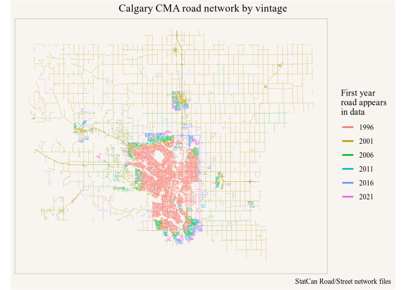
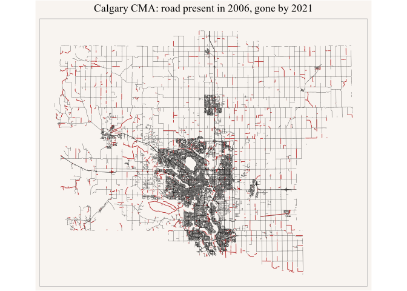

`get_road_network()` gives you each census year's road network on one schema,
but the years do not line up: the same road is cut into different arcs from one
release to the next, the identifiers change scheme three times across the
series, and every arc is redrawn a little as digitizing improves.
`build_temporal_network()` reconciles them into a single table in which each
segment carries the list of years it is present in.

This vignette is precomputed --- it downloads several hundred megabytes and
takes a few minutes --- but the code is exactly what you would run.


``` r
library(canstreet)
library(dplyr)
#> 
#> Attaching package: 'dplyr'
#> The following objects are masked from 'package:stats':
#> 
#>     filter, lag
#> The following objects are masked from 'package:base':
#> 
#>     intersect, setdiff, setequal, union
library(ggplot2)
```

## A region to work in

`within` takes any `sf`, `sfc` or `bbox` object, and the *same* polygon is
stamped across every year. That is not a convenience: Statistics Canada reuses
`CSDUID` and `CMAUID` codes across boundary revisions, so filtering on the
attribute would compare different ground in different years --- and the 1996
and 2006 files carry no region columns at all.

Any source of a polygon will do; `canstreet` does not depend on one. Here is
the 2021 Calgary CMA from `cancensus`, which needs no API key for the
geographies and already comes in EPSG:3347:


``` r
cma <- cancensus::get_statcan_geographies("2021", level = "CMA") |>
  filter(CMANAME == "Calgary")
#> Reading geographic data from local cache.

cma |> select(CMAUID, CMANAME) |> sf::st_drop_geometry()
#> # A tibble: 1 × 2
#>   CMAUID CMANAME
#> * <chr>  <chr>  
#> 1 825    Calgary
```

## Building

Name the years you want. Any two or more will do --- the census years are a
convention, not a requirement --- and anything not yet imported is downloaded
first. `NULL` uses whatever the cache already holds.


``` r
calgary <- build_temporal_network(
  "calgary", c(1996, 2001, 2006, 2011, 2016, 2021),
  within = cma, region_note = "2021 CMA boundary, Calgary (825)")

calgary
#> # A query:  ?? x 33
#> # Database: DuckDB 1.5.4 [jens@Darwin 25.6.0:R 4.6.0//Users/jens/data/canstreet/canstreet.duckdb]
#>    segment_id spine_vintage spine_id spine_piece spine_lo spine_hi years    
#>         <dbl>         <int> <chr>          <int>    <dbl>    <dbl> <list>   
#>  1          1          1996 125191             1        0        1 <int [1]>
#>  2          2          1996 125191             2        0        1 <int [1]>
#>  3          3          1996 125191             3        0        1 <int [1]>
#>  4          4          1996 125191             4        0        1 <int [1]>
#>  5          5          1996 125235             1        0        1 <int [1]>
#>  6          6          1996 125722             1        0        1 <int [1]>
#>  7          7          1996 126452             1        0        1 <int [1]>
#>  8          8          1996 126452             2        0        1 <int [1]>
#>  9          9          1996 126452             3        0        1 <int [1]>
#> 10         10          1996 126945             1        0        1 <int [1]>
#> # ℹ more rows
#> # ℹ 26 more variables: year_key <chr>, n_years <int>, first_year <int>,
#> #   last_year <int>, source_id <chr>, name <chr>, type <chr>, dir <chr>,
#> #   af_l <int>, at_l <int>, af_r <int>, at_r <int>, class <chr>, rank <chr>,
#> #   csduid_l <chr>, csduid_r <chr>, csdname_l <chr>, csdname_r <chr>,
#> #   csdtype_l <chr>, csdtype_r <chr>, cmauid_l <chr>, cmauid_r <chr>,
#> #   pruid_l <chr>, pruid_r <chr>, len_m <dbl>, geom <list>
```

The result is a lazy table like any other in this package, so it collects with
`collect_road_network()` and exports with `export_road_network()`.

## How much road was there, when

`year_key` is the set of years as a string, which makes "how many kilometres
were present in exactly these years" a plain `GROUP BY`:


``` r
calgary |>
  group_by(year_key) |>
  summarize(km = round(sum(len_m, na.rm = TRUE) / 1000, 1)) |>
  arrange(desc(km)) |>
  collect()
#> # A tibble: 50 × 2
#>    year_key                          km
#>    <chr>                          <dbl>
#>  1 1996|2001|2006|2011|2016|2021 4618. 
#>  2 2001|2006|2011|2016|2021      3823. 
#>  3 2016|2021                     1074. 
#>  4 2006|2011|2016|2021            924. 
#>  5 2001|2006|2011                 533. 
#>  6 2011|2016|2021                 499. 
#>  7 2021                           414. 
#>  8 2001                            71  
#>  9 1996                            55.8
#> 10 2006|2011                       45.9
#> # ℹ 40 more rows
```

`years` is the same set as a list column, which answers the other question ---
how much road existed in a given year, regardless of what else it overlapped:


``` r
vints <- c(1996, 2001, 2006, 2011, 2016, 2021)

tibble::tibble(year = vints, km = round(vapply(vints, function(y) {
  calgary |>
    filter(list_contains(years, y)) |>
    summarize(km = sum(len_m, na.rm = TRUE) / 1000) |>
    pull(km)
}, numeric(1)), 1))
#> # A tibble: 6 × 2
#>    year     km
#>   <dbl>  <dbl>
#> 1  1996  4864.
#> 2  2001  9254.
#> 3  2006 10145.
#> 4  2011 10643.
#> 5  2016 11088.
#> 6  2021 11505.
```

Read the 1996 figure against its coverage: the Street Network Files are urban
areas only, so what they cover inside a CMA is the built-up part of it, not the
whole CMA. 2001 is the first national file, and the jump from 1996 to 2001 is
mostly that change of coverage rather than road being built.

`n_years`, `first_year` and `last_year` fall out of the year set. Road that is
new since 1996 is `first_year > 1996`; road that has gone is `last_year < 2021`:


``` r
calgary |>
  summarize(
    new_since_2006_km = sum(ifelse(first_year > 2006, len_m, 0),
                            na.rm = TRUE) / 1000,
    retired_km        = sum(ifelse(last_year < 2021, len_m, 0),
                            na.rm = TRUE) / 1000) |>
  collect()
#> # A tibble: 1 × 2
#>   new_since_2006_km retired_km
#>               <dbl>      <dbl>
#> 1             2032.       892.
```

## Newer geometry wins

Positional accuracy improves across the series, so a segment's geometry is
always cut from the newest year it appears in. That is structural rather than a
post-hoc preference: the newest vintage is laid down as the spine first, and
each earlier year contributes geometry only where no later year covers it.
`spine_vintage` records which year a segment's geometry came from, and it
always equals `last_year`:


``` r
calgary |>
  count(spine_vintage, last_year) |>
  arrange(spine_vintage) |>
  collect()
#> # A tibble: 6 × 3
#>   spine_vintage last_year     n
#>           <int>     <int> <dbl>
#> 1          1996      1996   371
#> 2          2001      2001   296
#> 3          2006      2006   201
#> 4          2011      2011  1487
#> 5          2016      2016   154
#> 6          2021      2021 73153
```

## Segments are cut where the years disagree

The vintages do not agree on where one arc ends and the next begins, so
matching whole arc to whole arc fails for most of them. Instead each spine arc
is cut wherever any other year's coverage changes, which is why the build holds
more segments than any single year holds arcs:


``` r
get_road_network(vints, within = cma) |>
  count(vintage) |>
  arrange(vintage) |>
  collect()
#> # A tibble: 6 × 2
#>   vintage     n
#>     <int> <dbl>
#> 1    1996 27458
#> 2    2001 33782
#> 3    2006 35426
#> 4    2011 37960
#> 5    2016 63400
#> 6    2021 68101

calgary |> summarize(harmonized_segments = n()) |> collect()
#> # A tibble: 1 × 1
#>   harmonized_segments
#>                 <dbl>
#> 1               75662
```

## How the tolerance was chosen

Nothing here is matched on a number picked in advance. Before matching
anything, the build measures how far apart the two files put the *same* named
road, and the rate at which a given tolerance starts matching a road to its
neighbour instead:


``` r
temporal_network_calibration("calgary")
#> # A tibble: 5 × 10
#>   vintage tolerance_m n_pairs   recall_p50  recall_p90 disagree_10 disagree_25
#>     <int>       <dbl>   <int>        <dbl>       <dbl>       <dbl>       <dbl>
#> 1    2016          10   58101  0.000000798  0.00000191      0.0101      0.0105
#> 2    2011          40   36309 13.5         48.9             0.123       0.125 
#> 3    2006          40   33741 13.1         45.9             0.121       0.123 
#> 4    2001          40   27323 12.1         41.7             0.115       0.118 
#> 5    1996          39   23094 12.3         38.3             0.131       0.123 
#> # ℹ 3 more variables: disagree_40 <dbl>, dx <dbl>, dy <dbl>
```

`recall_p50` is the everyday positional disagreement between that year and
2021; `disagree_25` is the share of arcs whose nearest arc within 25 m carries
a different name. The tolerance is set where the second is still flat. Pass
`tolerance =` to override it, as a single number or a vector named by year.

Note the 2016 row: those two files share their base geometry almost exactly, so
the measured disagreement is effectively zero and the tolerance clamps to its
lower bound.

## The matching, exposed

`get_temporal_network_sources()` is the crosswalk --- one row per segment per
year, naming the arc of that year's file it corresponds to, how far away it
was, and which rule matched it:


``` r
get_temporal_network_sources("calgary") |>
  count(vintage, match_kind) |>
  arrange(vintage, desc(n)) |>
  collect()
#> # A tibble: 21 × 3
#>    vintage match_kind        n
#>      <int> <chr>         <dbl>
#>  1    1996 geometry+name 25911
#>  2    1996 name_rescue    6607
#>  3    1996 geometry       6476
#>  4    1996 spine           371
#>  5    2001 geometry+name 32479
#>  6    2001 geometry       9772
#>  7    2001 name_rescue    8971
#>  8    2001 spine           296
#>  9    2006 geometry+name 38875
#> 10    2006 name_rescue   12373
#> # ℹ 11 more rows
```

`spine` is the year the geometry came from. `geometry` and `geometry+name` are
close approaches that also agree on direction. `name_rescue` is the second
rule: for the long rural and highway arcs that older files digitize as a coarse
chord and newer ones as a detailed curve, the chord can sit hundreds of metres
from the road it represents, and only an exact street-name match at longer
range finds it. Without that rule those arcs are reported as retired roads ---
in Calgary, some 1,180 km of them. Because the rule is recorded rather than
hidden, a stricter analysis can drop it:


``` r
get_temporal_network_sources("calgary") |>
  filter(vintage == 2006) |>
  summarize(rescued = sum(ifelse(match_kind == 'name_rescue', 1, 0),
                          na.rm = TRUE),
            total = n()) |>
  collect()
#> # A tibble: 1 × 2
#>   rescued total
#>     <dbl> <dbl>
#> 1   12373 58262
```
We can show the harmonized network coloured by the first year each segment
appears in the data.


``` r
get_temporal_network("calgary") |>
  filter(list_contains(years, 2021L)) |>
  collect_road_network() %>%
  sf::st_transform(mountainmathHelpers::lambert_conformal_conic_at(.)) |>
  ggplot(aes(colour=factor(first_year))) +
  geom_sf(fill = "grey85",  linewidth=0.1) +
  labs(title = "Calgary CMA road network by vintage",
       colour="First year\nroad appears\nin data",
       caption="StatCan Road/Street network files") +
  guides(colour=guide_legend(override.aes=list(linewidth=1))) +
  coord_sf(datum=NA) 
```

<div class="figure">

<p class="caption">plot of chunk first-year-map</p>
</div>


## What actually disappeared

Road that was there in 2006 and is not there now:


``` r
retired <- get_temporal_network("calgary") |>
  filter(list_contains(years, 2006L), last_year < 2021) |>
  collect_road_network()

sum(retired$len_m) / 1000
#> [1] 715.5955
```


``` r
retired |>
  sf::st_drop_geometry() |>
  mutate(name = ifelse(is.na(name) | name == "", "(unnamed)", name)) |>
  group_by(name) |>
  summarize(km = round(sum(len_m) / 1000, 2)) |>
  arrange(desc(km)) |>
  head(10)
#> # A tibble: 10 × 2
#>    name                   km
#>    <chr>               <dbl>
#>  1 (unnamed)          442.  
#>  2 Township Road 261A   7.21
#>  3 Range Road 53        5.76
#>  4 Range Road 33        5.56
#>  5 210                  5.5 
#>  6 68                   5.48
#>  7 112                  5.21
#>  8 Township Road 232A   4.47
#>  9 Township Road 260    4.38
#> 10 56                   4.32
```


``` r
get_temporal_network("calgary") |>
  filter(list_contains(years, 2021L)) |>
  collect_road_network() %>%
  sf::st_transform(mountainmathHelpers::lambert_conformal_conic_at(.)) |>
  ggplot() +
  geom_sf(fill = "grey85", color = "black", linewidth=0.1) +
  geom_sf(data = retired, color = "firebrick", linewidth = 0.3) +
  labs(title = "Calgary CMA: road present in 2006, gone by 2021") +
  coord_sf(datum=NA)
```

<div class="figure">

<p class="caption">plot of chunk map</p>
</div>

A caution about reading this: it is honest about being a *lower* standard of
proof than the growth figures. New road is easy --- nothing needs to match.
Retirement is a negative claim, and any road the matcher failed to find looks
identical to a road that was removed. The count of segments whose year set has
an interior gap --- present in 1996 and 2021 but not 2006 --- is the single
best measure of how often that happens, since a road cannot un-exist and come
back:


``` r
by_key <- calgary |>
  group_by(year_key, first_year, last_year, n_years) |>
  summarize(km = sum(len_m, na.rm = TRUE) / 1000, .groups = "drop") |>
  collect()

# How many of the build's years lie between this segment's first and last?
expected <- colSums(outer(vints, by_key$first_year, ">=") &
                    outer(vints, by_key$last_year, "<="))
gap_km <- sum(by_key$km[by_key$n_years < expected])

c(gap_km = round(gap_km, 1), share = round(gap_km / sum(by_key$km), 4))
#>   gap_km    share 
#> 158.0000   0.0127
```

## Regions move under the roads

Because the crosswalk records each year's own `csduid_l` against a segment
whose geometry is fixed, boundary drift becomes a result rather than a caveat.
A road cannot change municipality on its own, so every row here is an
annexation, a boundary revision or a recoding:


``` r
temporal_network_region_drift("calgary") |>
  mutate(km = round(km, 1)) |>
  head(8)
#> # A tibble: 8 × 8
#>   vintage_from vintage_to csduid_from csdname_from      csduid_to csdname_to    
#>          <int>      <int> <chr>       <chr>             <chr>     <chr>         
#> 1         2011       2016 4806014     Rocky View County 4806021   Airdrie       
#> 2         2011       2016 4806001     Foothills No. 31  4806016   Calgary       
#> 3         2011       2016 4806014     Rocky View County 4806016   Calgary       
#> 4         2011       2016 4806014     Rocky View County 4806017   Chestermere   
#> 5         2011       2016 4806019     Cochrane          4806014   Rocky View Co…
#> 6         2016       2021 4806017     Chestermere       4806016   Calgary       
#> 7         2016       2021 4806016     Calgary           4806014   Rocky View Co…
#> 8         2011       2016 4806016     Calgary           4806014   Rocky View Co…
#> # ℹ 2 more variables: n_segments <dbl>, km <dbl>
```

Only years that carry the attribute can contribute --- 1996, 2001 and 2006
have no region columns at all, which is the other half of the reason the region
is stamped spatially.

## Builds in the cache


``` r
list_temporal_networks() |>
  select(name, vintages, n_segments, total_km, regional, built_at)
#> # A tibble: 1 × 6
#>   name    vintages                      n_segments total_km regional built_at   
#>   <chr>   <chr>                              <int>    <dbl> <lgl>    <chr>      
#> 1 calgary 1996,2001,2006,2011,2016,2021      75662   12397. TRUE     2026-08-28…
```

A build is a pair of tables in the same database as the vintages, so
`remove_temporal_network()` drops it instantly, and removing a vintage removes
the builds that depended on it.

`within = NULL` builds the whole country, but be warned that it is a much
heavier job than the region-scoped path, and on the machine this vignette was
written on a national two-vintage build did not finish: the coverage pass
spilled more than 32 GB of DuckDB temporary storage and ran the disk out.
Region-scoped builds are the supported scale for now, and they are also the
scale at which the calibration and the retired set can still be checked against
something you know.

## Attribution

Source data are © Statistics Canada, distributed under the
[Statistics Canada Open Licence](https://www.statcan.gc.ca/en/reference/licence).
Cite the product and reference year in anything you publish from it.
