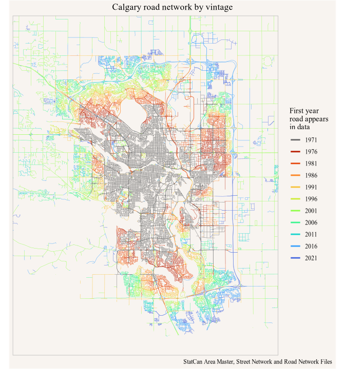
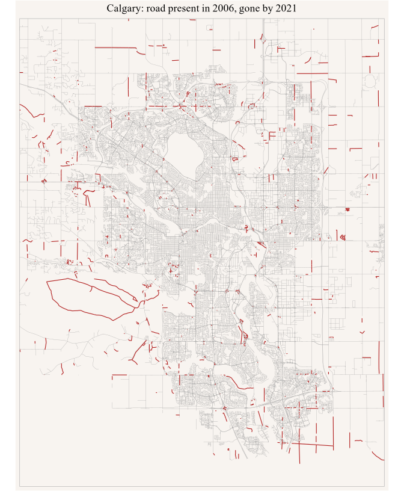

<!-- Generated from vignettes.orig/canstreet-temporal.Rmd -- do not edit. -->
<!-- Rebuild with: Rscript vignettes.orig/precompute.R -->


`get_road_network()` gives each census year on one schema, but the years do not
line up: the same road is cut into different arcs from one release to the next,
identifiers change scheme three times, and every arc is redrawn as digitizing
improves. `build_temporal_network()` reconciles them into one table in which
each segment carries the years it is present in.

This vignette is precomputed, but the code is what you would run.


``` r
library(canstreet)
library(dplyr)
library(ggplot2)
```

## A region to work in

`within` takes any `sf`, `sfc` or `bbox` object, and the same polygon is stamped
across every year: Statistics Canada reuses `CSDUID` and `CMAUID` across
boundary revisions, and the files before 2011 carry no region columns at all.
Any source of a polygon will do --- here is the 2021 Calgary CMA from
`cancensus`, which needs no API key for geographies:


``` r
cma <- cancensus::get_statcan_geographies("2021", level = "CMA") |>
  filter(CMANAME == "Calgary")
#> Reading geographic data from local cache.

cma |> select(CMAUID, CMANAME) |> sf::st_drop_geometry()
#> # A tibble: 1 × 2
#>   CMAUID CMANAME
#> * <chr>  <chr>  
#> 1 825    Calgary
```

## Building

Name the years --- any two or more --- and anything not yet imported is
downloaded first. `NULL` uses whatever the cache holds.


``` r
vints <- c(1971, 1976, 1981, 1986, 1991, 1996, 2001, 2006, 2011, 2016, 2021)

calgary <- build_temporal_network(
  "calgary", vints, within = cma,
  region_note = "2021 CMA boundary, Calgary (825)")

calgary
#> # A query:  ?? x 33
#> # Database: DuckDB 1.5.6 [jens@Darwin 27.0.0:R 4.6.0//Users/jens/data/canstreet/canstreet.duckdb]
#>    segment_id spine_vintage spine_id         spine_piece spine_lo spine_hi years
#>         <dbl>         <int> <chr>                  <int>    <dbl>    <dbl> <lis>
#>  1          1          1971 01-4835-0616-00…           1        0        1 <int>
#>  2          2          1971 01-4835-0616-01…           1        0        1 <int>
#>  3          3          1971 01-4835-0616-01…           2        0        1 <int>
#>  4          4          1971 01-4835-0616-01…           1        0        1 <int>
#>  5          5          1971 01-4835-0616-01…           1        0        1 <int>
#>  6          6          1971 01-4835-0616-01…           1        0        1 <int>
#>  7          7          1971 01-4835-0616-05…           1        0        1 <int>
#>  8          8          1971 01-4835-0616-05…           1        0        1 <int>
#>  9          9          1971 01-4835-0616-07…           1        0        1 <int>
#> 10         10          1971 01-4835-0616-07…           1        0        1 <int>
#> # ℹ more rows
#> # ℹ 26 more variables: year_key <chr>, n_years <int>, first_year <int>,
#> #   last_year <int>, source_id <chr>, name <chr>, type <chr>, dir <chr>,
#> #   af_l <int>, at_l <int>, af_r <int>, at_r <int>, class <chr>, rank <chr>,
#> #   csduid_l <chr>, csduid_r <chr>, csdname_l <chr>, csdname_r <chr>,
#> #   csdtype_l <chr>, csdtype_r <chr>, cmauid_l <chr>, cmauid_r <chr>,
#> #   pruid_l <chr>, pruid_r <chr>, len_m <dbl>, geom <list>
```

Building over the Area Master Files warns once for each of their four years,
1971 to 1986, that same-named arcs are systematically displaced; the calibration
section below comes back to it. A build already in the cache is returned as it
stands, without rebuilding or warning again, and `refresh = TRUE` forces one.

The result is a lazy table like any other in this package, so it collects with
`collect_road_network()` and exports with `export_road_network()`.

## How much road was there, when

`year_key` is the year set as a string, so "how many kilometres were present in
exactly these years" is a plain `GROUP BY`:


``` r
calgary |>
  group_by(year_key) |>
  summarize(km = round(sum(len_m, na.rm = TRUE) / 1000, 1)) |>
  arrange(desc(km)) |>
  collect()
#> # A tibble: 356 × 2
#>    year_key                                                  km
#>    <chr>                                                  <dbl>
#>  1 2001|2006|2011|2016|2021                               3760.
#>  2 1971|1976|1981|1986|1991|1996|2001|2006|2011|2016|2021 2255 
#>  3 2016|2021                                              1056.
#>  4 2006|2011|2016|2021                                     919.
#>  5 2001|2006|2011                                          530.
#>  6 1981|1986|1991|1996|2001|2006|2011|2016|2021            509.
#>  7 1976|1981|1986|1991|1996|2001|2006|2011|2016|2021       494 
#>  8 2011|2016|2021                                          494.
#>  9 1991|1996|2001|2006|2011|2016|2021                      488.
#> 10 1996|2001|2006|2011|2016|2021                           444.
#> # ℹ 346 more rows
```

`years` is the same set as a list column, for how much road existed in a given
year:


``` r
tibble::tibble(year = vints, km = round(vapply(vints, function(y) {
  calgary |>
    filter(list_contains(years, y)) |>
    summarize(km = sum(len_m, na.rm = TRUE) / 1000) |>
    pull(km)
}, numeric(1)), 1))
#> # A tibble: 11 × 2
#>     year     km
#>    <dbl>  <dbl>
#>  1  1971  2479.
#>  2  1976  2948.
#>  3  1981  3492.
#>  4  1986  3848.
#>  5  1991  4421.
#>  6  1996  4864.
#>  7  2001  9256 
#>  8  2006 10146.
#>  9  2011 10645.
#> 10  2016 11088.
#> 11  2021 11505.
```

Everything up to 1996 is urban areas only and 2001 is the first national file,
so the jump between them is mostly coverage, not road being built. The steadier
climb before it is a statement about the files as well: each holds the urban
area as that census drew it.

`first_year`, `last_year` and `n_years` fall out of the year set:


``` r
calgary |>
  summarize(
    new_since_2006_km = sum(ifelse(first_year > 2006, len_m, 0),
                            na.rm = TRUE) / 1000,
    retired_km        = sum(ifelse(last_year < 2021, len_m, 0),
                            na.rm = TRUE) / 1000) |>
  collect()
#> # A tibble: 1 × 2
#>   new_since_2006_km retired_km
#>               <dbl>      <dbl>
#> 1             2008.      1025.
```

## Newer geometry wins

A segment's geometry is cut from the newest year it appears in: the newest
vintage is laid down as the spine, and each earlier year contributes only where
no later one covers it. So `spine_vintage` always equals `last_year`:


``` r
calgary |>
  count(spine_vintage, last_year) |>
  arrange(spine_vintage) |>
  collect()
#> # A tibble: 11 × 3
#>    spine_vintage last_year     n
#>            <int>     <int> <dbl>
#>  1          1971      1971   213
#>  2          1976      1976   212
#>  3          1981      1981   180
#>  4          1986      1986   332
#>  5          1991      1991   203
#>  6          1996      1996   388
#>  7          2001      2001   313
#>  8          2006      2006   214
#>  9          2011      2011  1543
#> 10          2016      2016   159
#> 11          2021      2021 77475
```

## Segments are cut where the years disagree

The vintages disagree on where one arc ends and the next begins, so each spine
arc is cut wherever another year's coverage changes. The build therefore holds
more segments than any single year holds arcs:


``` r
get_road_network(vints, within = cma) |>
  count(vintage) |>
  arrange(vintage) |>
  collect()
#> # A tibble: 11 × 2
#>    vintage     n
#>      <int> <dbl>
#>  1    1971 16013
#>  2    1976 19661
#>  3    1981 23889
#>  4    1986 32603
#>  5    1991 24637
#>  6    1996 27458
#>  7    2001 33782
#>  8    2006 35426
#>  9    2011 37960
#> 10    2016 63400
#> 11    2021 68101

calgary |> summarize(harmonized_segments = n()) |> collect()
#> # A tibble: 1 × 1
#>   harmonized_segments
#>                 <dbl>
#> 1               81232
```

## How the tolerance was chosen

The tolerance is measured, not picked: how far apart two files put the same
named road, against the rate at which a tolerance starts matching the
neighbouring road instead.


``` r
temporal_network_calibration("calgary") |>
  select(vintage, tolerance_m, n_pairs, recall_p50, disagree_25, dx, dy)
#> # A tibble: 10 × 7
#>    vintage tolerance_m n_pairs   recall_p50 disagree_25     dx      dy
#>      <int>       <dbl>   <int>        <dbl>       <dbl>  <dbl>   <dbl>
#>  1    2016          10   58101  0.000000798      0.0105 0.0013 -0.0176
#>  2    2011          40   36309 13.5              0.125  0.351  -3.85  
#>  3    2006          40   33741 13.1              0.123  0.577  -3.40  
#>  4    2001          40   27323 12.1              0.118  0.761  -2.77  
#>  5    1996          39   23094 12.3              0.123  1.44    5.08  
#>  6    1991          35   20785 11.8              0.114  1.77    5.93  
#>  7    1986          40   23048 16.8              0.173  6.92    8.48  
#>  8    1981          40   20164 16.6              0.168  6.89    9.17  
#>  9    1976          40   16613 17.3              0.188  7.11    9.34  
#> 10    1971          40   13512 19.9              0.233  7.67   12.9
```

`recall_p50` is the positional disagreement against 2021; `disagree_25` the
share of arcs whose nearest arc within 25 m carries a different name. The
tolerance is set where the second is still flat, and `tolerance =` overrides it
as a number or a vector named by year. 2016 clamps to the lower bound because
it shares 2021's base geometry.

`dx` and `dy` are the mean offset to the same-named 2021 arc, in metres along
the axes of the storage projection, and they are what the build warned about.
A few metres either way is ordinary. The four Area Master File years sit a
steady 11 to 15 m off, all in the same direction, which is a difference in
registration rather than noise. The matcher does not correct a shift, it absorbs
it --- those years calibrate to the 40 m ceiling, with `disagree_25` well above
the later files' --- so treat a difference at that scale in 1971 to 1986 as
unresolved. It is Calgary's result, not the product's: Vancouver's Area Master
Files register as well as any file before 2011 (`vignette("canstreet-vancouver")`).

## The matching, exposed

`get_temporal_network_sources()` is the crosswalk --- one row per segment per
year, naming the arc of that year's file it corresponds to, how far away it
was, and which rule matched it:


``` r
get_temporal_network_sources("calgary") |>
  count(vintage, match_kind) |>
  arrange(vintage, desc(n)) |>
  collect()
#> # A tibble: 41 × 3
#>    vintage match_kind        n
#>      <int> <chr>         <dbl>
#>  1    1971 geometry+name 12015
#>  2    1971 geometry       5537
#>  3    1971 name_rescue    2855
#>  4    1971 spine           213
#>  5    1976 geometry+name 15355
#>  6    1976 geometry       6159
#>  7    1976 name_rescue    3006
#>  8    1976 spine           212
#>  9    1981 geometry+name 18413
#> 10    1981 geometry       7640
#> # ℹ 31 more rows
```

`spine` is the year the geometry came from; `geometry` and `geometry+name` are
close approaches that also agree on direction. `name_rescue` is the second
rule, for the long rural and highway arcs an older file draws as a chord
hundreds of metres off the modern curve --- without it Calgary reports some
1,180 km of its 2006 road as retired. It is recorded rather than hidden, so a
stricter analysis can drop it:


``` r
get_temporal_network_sources("calgary") |>
  filter(vintage == 2006) |>
  summarize(rescued = sum(ifelse(match_kind == 'name_rescue', 1, 0),
                          na.rm = TRUE),
            total = n()) |>
  collect()
#> # A tibble: 1 × 2
#>   rescued total
#>     <dbl> <dbl>
#> 1   12965 62345
```

## The map

The harmonized network, coloured by the year each segment first appears. Most of
the CMA's area is rural grid, so the maps here are framed on the City of Calgary
by handing its bounding box to `coord_sf()`:


``` r
calgary_crs <- mountainmathHelpers::lambert_conformal_conic_at(cma)

frame <- cancensus::get_statcan_geographies("2021", level = "CSD") |>
  filter(CSDUID == "4806016") |>
  sf::st_transform(calgary_crs) |>
  sf::st_bbox()
#> Reading geographic data from local cache.

colours <- c("grey40", viridis::viridis(length(vints) - 1, option = "turbo",
                                        direction = -1, begin = 0.12, end = 0.92))

get_temporal_network("calgary") |>
  filter(list_contains(years, 2021L)) |>
  collect_road_network() |>
  sf::st_transform(calgary_crs) |>
  ggplot(aes(colour = factor(first_year))) +
  geom_sf(linewidth = 0.15) +
  scale_colour_manual(values = colours) +
  labs(title = "Calgary road network by vintage",
       colour = "First year\nroad appears\nin data",
       caption = "StatCan Area Master, Street Network and Road Network Files") +
  guides(colour = guide_legend(override.aes = list(linewidth = 1))) +
  coord_sf(datum = NA, xlim = frame[c("xmin", "xmax")],
           ylim = frame[c("ymin", "ymax")])
```

<div class="figure">

<p class="caption">plot of chunk first-year-map</p>
</div>

The grey core is what the 1971 file held and the rings around it are the urban
files following the city outward to 1996; the green grid at the edges of the
frame is 2001 going national.

## What actually disappeared

Road that was there in 2006 and is not there now:


``` r
retired <- get_temporal_network("calgary") |>
  filter(list_contains(years, 2006L), last_year < 2021) |>
  collect_road_network()

sum(retired$len_m) / 1000
#> [1] 713.3031
```


``` r
retired |>
  sf::st_drop_geometry() |>
  mutate(name = ifelse(is.na(name) | name == "", "(unnamed)", name)) |>
  group_by(name) |>
  summarize(km = round(sum(len_m) / 1000, 2)) |>
  arrange(desc(km)) |>
  head(10)
#> # A tibble: 10 × 2
#>    name                   km
#>    <chr>               <dbl>
#>  1 (unnamed)          441.  
#>  2 Township Road 261A   7.21
#>  3 Range Road 53        5.76
#>  4 Range Road 33        5.56
#>  5 210                  5.5 
#>  6 68                   5.46
#>  7 112                  5.21
#>  8 Township Road 232A   4.47
#>  9 Township Road 260    4.38
#> 10 56                   4.32
```

Most of those 713 km lie outside the city, on the rural grid --- about 150 km
are inside the city boundary. The same frame as before:


``` r
get_temporal_network("calgary") |>
  filter(list_contains(years, 2021L)) |>
  collect_road_network() |>
  sf::st_transform(calgary_crs) |>
  ggplot() +
  geom_sf(colour = "grey60", linewidth = 0.1) +
  geom_sf(data = retired, colour = "firebrick", linewidth = 0.4) +
  labs(title = "Calgary: road present in 2006, gone by 2021") +
  coord_sf(datum = NA, xlim = frame[c("xmin", "xmax")],
           ylim = frame[c("ymin", "ymax")])
```

<div class="figure">

<p class="caption">plot of chunk map</p>
</div>

Retirement is a weaker claim than growth: a road the matcher missed looks
identical to one that was removed. Segments whose year set has an interior gap
--- present in 1996 and 2021 but not 2006 --- measure how often that happens,
since a road cannot un-exist and come back:


``` r
by_key <- calgary |>
  group_by(year_key, first_year, last_year, n_years) |>
  summarize(km = sum(len_m, na.rm = TRUE) / 1000, .groups = "drop") |>
  collect()

# How many of the build's years lie between this segment's first and last?
expected <- colSums(outer(vints, by_key$first_year, ">=") &
                    outer(vints, by_key$last_year, "<="))
gap_km <- sum(by_key$km[by_key$n_years < expected])

c(gap_km = round(gap_km, 1), share = round(gap_km / sum(by_key$km), 4))
#>   gap_km    share 
#> 359.4000   0.0287
```

## Regions move under the roads

The crosswalk records each year's own `csduid_l` against a segment whose
geometry is fixed, so every row here is an annexation, a boundary revision or a
recoding:


``` r
temporal_network_region_drift("calgary") |>
  mutate(km = round(km, 1)) |>
  head(8)
#> # A tibble: 8 × 8
#>   vintage_from vintage_to csduid_from csdname_from      csduid_to csdname_to    
#>          <int>      <int> <chr>       <chr>             <chr>     <chr>         
#> 1         2011       2016 4806014     Rocky View County 4806021   Airdrie       
#> 2         2011       2016 4806001     Foothills No. 31  4806016   Calgary       
#> 3         2011       2016 4806014     Rocky View County 4806016   Calgary       
#> 4         2011       2016 4806014     Rocky View County 4806017   Chestermere   
#> 5         2011       2016 4806019     Cochrane          4806014   Rocky View Co…
#> 6         2016       2021 4806017     Chestermere       4806016   Calgary       
#> 7         2016       2021 4806016     Calgary           4806014   Rocky View Co…
#> 8         2011       2016 4806016     Calgary           4806014   Rocky View Co…
#> # ℹ 2 more variables: n_segments <dbl>, km <dbl>
```

Only years carrying the attribute contribute, and nothing before 2011 does.

## Builds in the cache


``` r
list_temporal_networks() |>
  select(name, vintages, n_segments, total_km, regional, built_at)
#> # A tibble: 2 × 6
#>   name      vintages                       n_segments total_km regional built_at
#>   <chr>     <chr>                               <int>    <dbl> <lgl>    <chr>   
#> 1 calgary   1971,1976,1981,1986,1991,1996…      81232   12529. TRUE     2026-10…
#> 2 vancouver 1971,1976,1981,1986,1991,1996…      87277   11379. TRUE     2026-10…
```

A build is a pair of tables beside the vintages, so `remove_temporal_network()`
drops it instantly, and removing a vintage removes the builds that used it.

`within = NULL` builds nationally, but that is not yet the supported scale: a
national two-vintage build spilled over 32 GB of DuckDB temporary storage here
and did not finish. Use region-scoped builds.

## Attribution

Source data are © Statistics Canada, distributed under the
[Statistics Canada Open Licence](https://www.statcan.gc.ca/en/reference/licence).
Cite the product and reference year in anything you publish from it.
