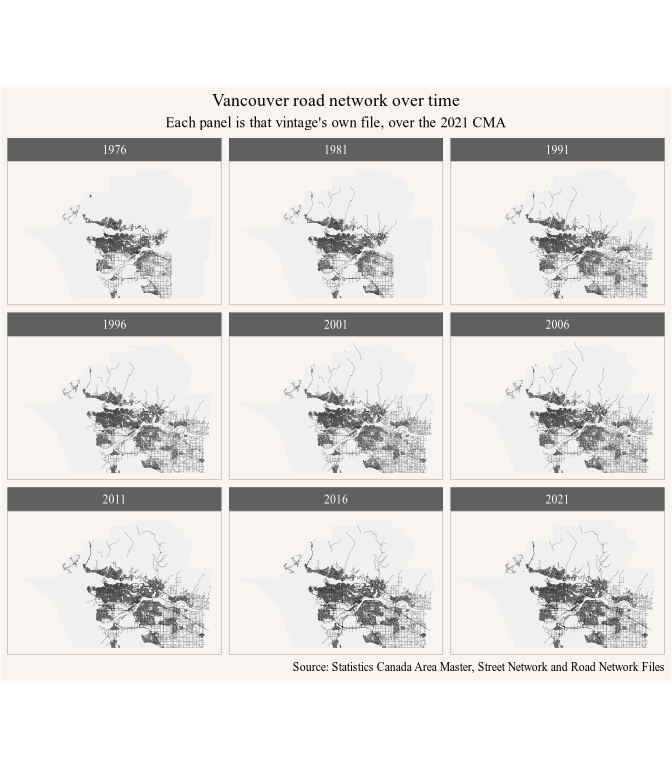
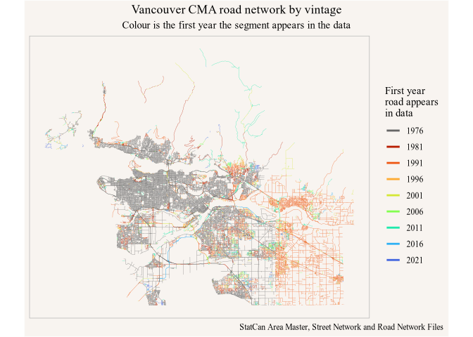
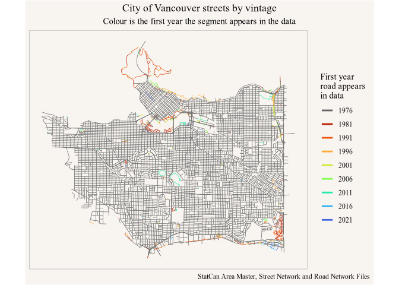

<!-- Generated from vignettes.orig/canstreet-vancouver.Rmd -- do not edit. -->
<!-- Rebuild with: Rscript vignettes.orig/precompute.R -->


Vancouver reaches two decades further back than the Calgary vignette, because
the two Area Master Files Statistics Canada deposited for 1976 and 1981 cover
British Columbia. That is nine vintages over forty-five years in four formats
--- mainframe flat files no GIS driver opens, Street Network File coverages, a
MapInfo interchange pair, and Road Network File shapefiles --- which the package
makes irrelevant to the caller.


``` r
library(canstreet)
library(dplyr)
library(ggplot2)
```

## A region to work in

As in the Calgary vignette, one fixed polygon is stamped across every year
rather than filtering on a region attribute, which the pre-2011 files do not
carry anyway:


``` r
cma <- cancensus::get_statcan_geographies("2021", level = "CMA", type="digital") |>
  filter(CMANAME == "Vancouver")
#> Reading geographic data from local cache.

vancouver_crs <- "+proj=lcc +lat_1=49.0000658247404 +lat_2=49.5742753405107 +lat_0=49.2871705826255 +lon_0=-123.073508713002 +x_0=0 +y_0=0 +ellps=GRS80 +datum=NAD83 +units=m +no_defs"

cma |> sf::st_drop_geometry() |> select(CMAUID, CMANAME)
#> # A tibble: 1 × 2
#>   CMAUID CMANAME  
#>   <chr>  <chr>    
#> 1 933    Vancouver
```

## Overview

Before 2001's national reach the files hold only the larger urban areas, and
which areas counted changed from vintage to vintage. Nine reads of nine
products, varying only the year:


``` r
vints <- c(1976, 1981, 1991, 1996, 2001, 2006, 2011, 2016, 2021)

overview <- vints |>
  lapply(function(y) {
    get_road_network(y, within = cma, roads_only = TRUE, quiet = TRUE) |>
      select(vintage, geom) |>
      collect_road_network()
  }) |>
  (\(x) do.call(rbind, x))()

ggplot(overview |> sf::st_transform(vancouver_crs)) +
  geom_sf(data = cma |> sf::st_transform(vancouver_crs),
          fill = "grey94", colour = NA) +
  geom_sf(linewidth = 0.05) +
  facet_wrap(~vintage, ncol = 3) +
  coord_sf(datum = NA) +
  labs(title = "Vancouver road network over time",
       subtitle = "Each panel is that vintage's own file, over the 2021 CMA",
       caption = "Source: Statistics Canada Area Master, Street Network and Road Network Files")
```

<div class="figure">

<p class="caption">plot of chunk overview</p>
</div>

Most of what fills in before 2001 is coverage, not construction --- keep that in
mind for `first_year` below.


## Building

The Area Master Files join the series like any other vintage:


``` r

vancouver <- build_temporal_network(
  "vancouver", vints, within = cma,
  region_note = "2021 CMA boundary, Vancouver (933)") 

vancouver
#> # A query:  ?? x 33
#> # Database: DuckDB 1.5.4 [jens@Darwin 25.6.0:R 4.6.0//Users/jens/data/canstreet/canstreet.duckdb]
#>    segment_id spine_vintage spine_id         spine_piece spine_lo spine_hi years
#>         <dbl>         <int> <chr>                  <int>    <dbl>    <dbl> <lis>
#>  1          1          1976 01-5937-1563-00…           1        0        1 <int>
#>  2          2          1976 01-5937-1563-00…           1        0        1 <int>
#>  3          3          1976 01-5937-1563-00…           1        0        1 <int>
#>  4          4          1976 01-5937-1563-00…           1        0        1 <int>
#>  5          5          1976 01-5937-1563-00…           1        0        1 <int>
#>  6          6          1976 01-5937-1563-00…           1        0        1 <int>
#>  7          7          1976 01-5937-1563-00…           1        0        1 <int>
#>  8          8          1976 01-5937-1563-00…           1        0        1 <int>
#>  9          9          1976 01-5937-1563-00…           1        0        1 <int>
#> 10         10          1976 01-5937-1563-00…           1        0        1 <int>
#> # ℹ more rows
#> # ℹ 26 more variables: year_key <chr>, n_years <int>, first_year <int>,
#> #   last_year <int>, source_id <chr>, name <chr>, type <chr>, dir <chr>,
#> #   af_l <int>, at_l <int>, af_r <int>, at_r <int>, class <chr>, rank <chr>,
#> #   csduid_l <chr>, csduid_r <chr>, csdname_l <chr>, csdname_r <chr>,
#> #   csdtype_l <chr>, csdtype_r <chr>, cmauid_l <chr>, cmauid_r <chr>,
#> #   pruid_l <chr>, pruid_r <chr>, len_m <dbl>, geom <list>
```

## Read `first_year` as "first mapped", not "first built"

`first_year` is the earliest vintage a segment was matched in --- a statement
about the files, which do not all cover the same ground:


``` r
list_road_network_vintages() |>
  filter(vintage %in% vints) |>
  select(vintage, product, coverage, n_segments)
#> # A tibble: 9 × 4
#>   vintage product coverage n_segments
#>     <int> <chr>   <chr>         <int>
#> 1    1976 AMF     bc-urban      60883
#> 2    1981 AMF     bc-urban     103774
#> 3    1991 SNF     urban        599625
#> 4    1996 SNF     urban        629574
#> 5    2001 RNF     national    2053112
#> 6    2006 RNF     national    1869564
#> 7    2011 RNF     national    1973932
#> 8    2016 RNF     national    2163058
#> 9    2021 RNF     national    2242117
```

A road in Langley that first appears in 2001 may well have been there in 1976,
simply outside what anyone had digitized. Growth and coverage are confounded,
and matching cannot separate them. The kilometres present in each year stack
both effects:


``` r
tibble::tibble(year = vints, km = round(vapply(vints, function(y) {
  vancouver |>
    filter(list_contains(years, y)) |>
    summarize(km = sum(len_m, na.rm = TRUE) / 1000) |>
    pull(km)
}, numeric(1)), 1))
#> # A tibble: 9 × 2
#>    year     km
#>   <dbl>  <dbl>
#> 1  1976  6494 
#> 2  1981  7069.
#> 3  1991  9316.
#> 4  1996  9472 
#> 5  2001  9955.
#> 6  2006 10079.
#> 7  2011 10220.
#> 8  2016 10380.
#> 9  2021 10493.
```

## Where the confounding goes away

Inside a municipality already fully mapped in 1976 the coverage problem does not
arise. Subset it with a polygon, not an attribute: `csduid_l` comes from the
vintage a segment's geometry was cut from, and the 1976--2006 files carry no
region columns, so an attribute filter would drop exactly the oldest segments.


``` r
van_city <- cancensus::get_statcan_geographies("2021", level = "CSD", type = "digital") |>
  filter(CSDUID == "5915022")
#> Reading geographic data from local cache.

city <- get_temporal_network("vancouver", within = van_city)

by_first <- function(x) {
  x |>
    group_by(first_year) |>
    summarize(km = sum(len_m, na.rm = TRUE) / 1000) |>
    collect() |>
    arrange(first_year) |>
    mutate(share = round(km / sum(km), 3), km = round(km, 1))
}

by_first(vancouver) |>
  rename(km_cma = km, share_cma = share) |>
  left_join(by_first(city) |> rename(km_city = km, share_city = share),
            by = "first_year")
#> # A tibble: 9 × 5
#>   first_year km_cma share_cma km_city share_city
#>        <int>  <dbl>     <dbl>   <dbl>      <dbl>
#> 1       1976 6494       0.571  1499.       0.935
#> 2       1981  695.      0.061    27.8      0.017
#> 3       1991 2421.      0.213    29.9      0.019
#> 4       1996  342.      0.03     13.4      0.008
#> 5       2001  556.      0.049    12.4      0.008
#> 6       2006  174.      0.015     4.9      0.003
#> 7       2011  454.      0.04     10.9      0.007
#> 8       2016  139.      0.012     2.6      0.002
#> 9       2021   88.1     0.008     2.2      0.001
```

In the city 93% of the length was already mapped in 1976 --- the grid was
substantially complete, and what came later is infill. CMA-wide it is 57%, with
1991 alone adding 2,421 km: that is the Street Network File reaching past the
1981 urban envelope, not road being built.


## The map

The concentric structure is real growth; the hard edges are where a file's
coverage stopped. Only segments still present in 2021 are drawn.


``` r
plot_first_year <- function(x, title, linewidth = 0.1) {
  colours <- c("grey40",viridis::viridis(length(vints)-1, option = "turbo", direction = -1,
                           begin = 0.12, end = 0.92))
  x |>
    filter(list_contains(years, 2021L)) |>
    collect_road_network() |>
    sf::st_transform(vancouver_crs) |>
    ggplot(aes(colour = factor(first_year))) +
    geom_sf(linewidth = linewidth) +
    scale_colour_manual(values = colours) +
    labs(title = title,
         subtitle = "Colour is the first year the segment appears in the data",
         colour = "First year\nroad appears\nin data",
         caption = "StatCan Area Master, Street Network and Road Network Files") +
    guides(colour = guide_legend(override.aes = list(linewidth = 1))) +
    coord_sf(datum = NA)
}

plot_first_year(vancouver, "Vancouver CMA road network by vintage")
```

<div class="figure">

<p class="caption">plot of chunk first-year-map</p>
</div>

Zooming to the City of Vancouver takes the coverage edges out of the frame, so
what remains is close to a map of when the city's streets were built.


``` r
plot_first_year(city, "City of Vancouver streets by vintage",
                linewidth = 0.25)
```

<div class="figure">

<p class="caption">plot of chunk core-map</p>
</div>

## Matching across forty-five years

The Area Master Files might be expected to be the weak link --- hand-digitized
map sheets, NAD27 UTM coordinates, packed two decimal digits to the byte. The
calibration says otherwise:


``` r
temporal_network_calibration("vancouver")
#> # A tibble: 8 × 10
#>   vintage tolerance_m n_pairs   recall_p50  recall_p90 disagree_10 disagree_25
#>     <int>       <dbl>   <int>        <dbl>       <dbl>       <dbl>       <dbl>
#> 1    2016          10   68868  0.000000814  0.00000191      0.0036      0.0038
#> 2    2011          10   66875  0            0               0.0099      0.0105
#> 3    2006          37   52408 11.6         36.5             0.106       0.123 
#> 4    2001          36   49702 11.2         35.3             0.107       0.122 
#> 5    1996          38   45630 15.7         37.7             0.187       0.176 
#> 6    1991          38   43965 15.6         37.5             0.191       0.180 
#> 7    1981          34   41377 10.9         33.5             0.135       0.150 
#> 8    1976          37   36687 11.4         36.4             0.144       0.161 
#> # ℹ 3 more variables: disagree_40 <dbl>, dx <dbl>, dy <dbl>
```

`recall_p50` is the positional disagreement against 2021, measured on roads the
two files name alike. 1976 and 1981 come in at 11.5 m and 11.0 m --- *better*
than 1991 and 1996 at 15.7 m, and on a par with 2001 and 2006. What improves
after 2006 is vertex density rather than registration; 2011 and 2016 share
2021's base geometry, which is why they calibrate to the 10 m floor.

The crosswalk records how each year's segments were matched:


``` r
get_temporal_network_sources("vancouver") |>
  count(vintage, match_kind) |>
  arrange(vintage, desc(n)) |>
  collect()
#> # A tibble: 33 × 3
#>    vintage match_kind        n
#>      <int> <chr>         <dbl>
#>  1    1976 geometry+name 32192
#>  2    1976 geometry      10548
#>  3    1976 name_rescue    5649
#>  4    1976 spine           306
#>  5    1981 geometry+name 35098
#>  6    1981 geometry      11157
#>  7    1981 name_rescue    6409
#>  8    1981 spine           824
#>  9    1991 geometry+name 43618
#> 10    1991 geometry      14605
#> # ℹ 23 more rows
```

`name_rescue` is the long-range same-name match, for arterials an older file
draws as a coarse chord the modern geometry departs from. It is recorded rather
than folded in, so a stricter reading is a filter away.

## The raw Area Master File

No GIS driver opens the Area Master File --- fixed-width mainframe records, 113
bytes in 1976 and 95 in 1981, the second in EBCDIC with packed-decimal
coordinates --- so the package parses it. `read_amf()` exposes it directly, as
segments or as the node records the file stores:


``` r
amf <- canstreet_download(1976)
nodes <- read_amf(amf$path[amf$filename == "vancouver.data"], nodes = TRUE)

nodes |>
  select(sheet_name, feature, seq_no, name, type, class, x, y, zone) |>
  head(5)
#> # A tibble: 5 × 9
#>   sheet_name   feature seq_no name  type  class      x       y  zone
#>   <chr>          <int>  <int> <chr> <chr> <chr>  <dbl>   <dbl> <int>
#> 1 BOWEN ISLAND    1000     60 ADAMS RD    <NA>  470779 5467091    10
#> 2 BOWEN ISLAND    1000     65 ADAMS RD    <NA>  470634 5467057    10
#> 3 BOWEN ISLAND    1000     70 ADAMS RD    <NA>  470493 5467025    10
#> 4 BOWEN ISLAND    1000     75 ADAMS RD    <NA>  470431 5467051    10
#> 5 BOWEN ISLAND    1000     80 ADAMS RD    <NA>  470275 5467037    10
```

A node carries the feature's name and type, a class where it is not an ordinary
street, the civic address range on each side, and a NAD27 UTM coordinate in its
map sheet's zone. A segment is the block face between two consecutive nodes ---
median length about 100 m, finer than the later files use.

## Attribution

Source data are © Statistics Canada, distributed under the
[Statistics Canada Open Licence](https://www.statcan.gc.ca/en/reference/licence).
Cite the product and reference year in anything you publish from it.
