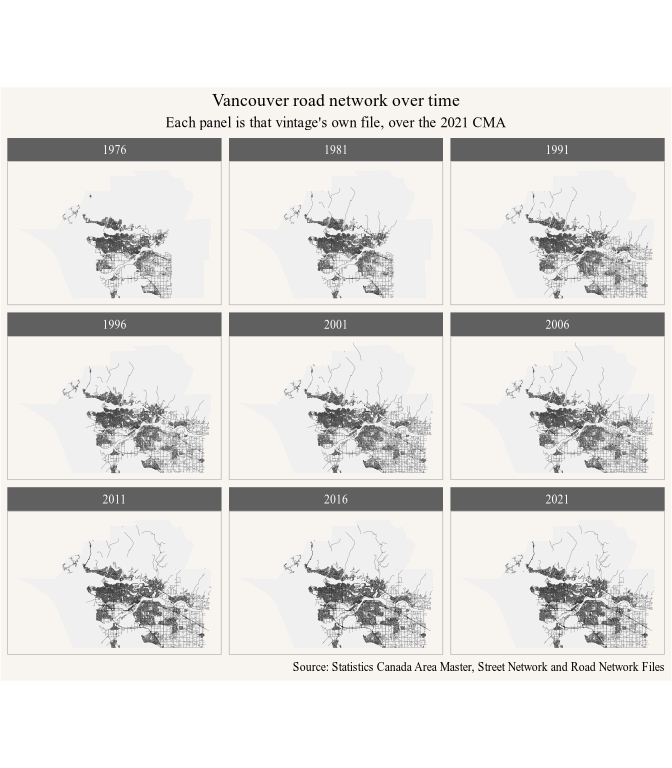
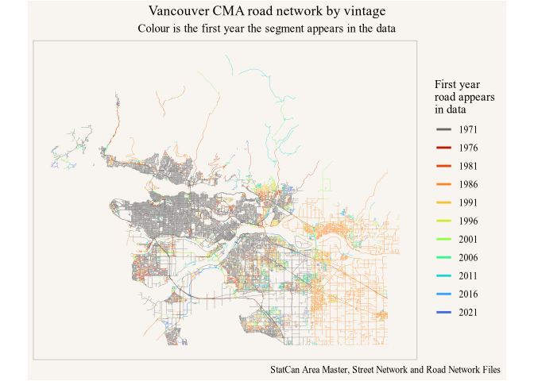
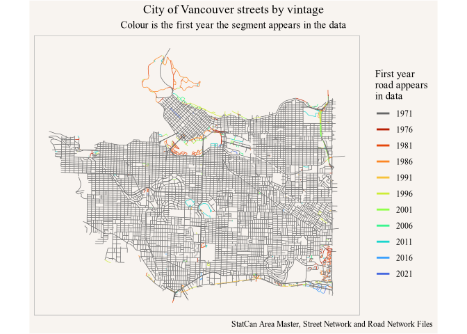

<!-- Generated from vignettes.orig/canstreet-vancouver.Rmd -- do not edit. -->
<!-- Rebuild with: Rscript vignettes.orig/precompute.R -->


The Calgary vignette explains a build; this one reads one. It is the eleven
census years from 1971 to 2021, in four formats --- mainframe flat files no GIS
driver opens, Street Network File coverages, a MapInfo interchange pair, and
Road Network File shapefiles --- which the package makes irrelevant to the
caller. Vancouver is the region to read it over because its Area Master Files
reach well beyond the city from the start, twelve municipal files of them in
1971, so half a century of one metropolitan area is in view from the first
year.


``` r
library(canstreet)
library(dplyr)
library(ggplot2)
```

## A region to work in

As in the Calgary vignette, one fixed polygon is stamped across every year
rather than filtering on a region attribute, which the pre-2011 files do not
carry anyway:


``` r
cma <- cancensus::get_statcan_geographies("2021", level = "CMA", type="digital") |>
  filter(CMANAME == "Vancouver")
#> Reading geographic data from local cache.

vancouver_crs <- "+proj=lcc +lat_1=49.0000658247404 +lat_2=49.5742753405107 +lat_0=49.2871705826255 +lon_0=-123.073508713002 +x_0=0 +y_0=0 +ellps=GRS80 +datum=NAD83 +units=m +no_defs"

cma |> sf::st_drop_geometry() |> select(CMAUID, CMANAME)
#> # A tibble: 1 × 2
#>   CMAUID CMANAME  
#>   <chr>  <chr>    
#> 1 933    Vancouver
```

## Overview

Before 2001's national reach the files hold only the larger urban areas, and
which areas counted changed from vintage to vintage. Eleven reads, varying only
the year:


``` r
vints <- c(1971, 1976, 1981, 1986, 1991, 1996, 2001, 2006, 2011, 2016, 2021)

overview <- vints |>
  lapply(function(y) {
    get_road_network(y, within = cma, roads_only = TRUE, quiet = TRUE) |>
      select(vintage, geom) |>
      collect_road_network()
  }) |>
  (\(x) do.call(rbind, x))()

ggplot(overview |> sf::st_transform(vancouver_crs)) +
  geom_sf(data = cma |> sf::st_transform(vancouver_crs),
          fill = "grey94", colour = NA) +
  geom_sf(linewidth = 0.05) +
  facet_wrap(~vintage, ncol = 3) +
  coord_sf(datum = NA) +
  labs(title = "Vancouver road network over time",
       subtitle = "Each panel is that vintage's own file, over the 2021 CMA",
       caption = "Source: Statistics Canada Area Master, Street Network and Road Network Files")
```

<div class="figure">

<p class="caption">plot of chunk overview</p>
</div>

Most of what fills in before 2001 is coverage, not construction --- the eastern
end of the region arrives all at once in 1986. Keep that in mind for
`first_year` below.


## Building

The Area Master Files join the series like any other vintage:


``` r

vancouver <- build_temporal_network(
  "vancouver", vints, within = cma,
  region_note = "2021 CMA boundary, Vancouver (933)") 

vancouver
#> # A query:  ?? x 33
#> # Database: DuckDB 1.5.6 [jens@Darwin 27.0.0:R 4.6.0//Users/jens/data/canstreet/canstreet.duckdb]
#>    segment_id spine_vintage spine_id         spine_piece spine_lo spine_hi years
#>         <dbl>         <int> <chr>                  <int>    <dbl>    <dbl> <lis>
#>  1          1          1971 01-5937-0464-01…           1        0        1 <int>
#>  2          2          1971 01-5937-0464-01…           1        0        1 <int>
#>  3          3          1971 01-5937-0464-01…           1        0        1 <int>
#>  4          4          1971 01-5937-0464-05…           1        0        1 <int>
#>  5          5          1971 01-5937-0464-05…           1        0        1 <int>
#>  6          6          1971 01-5937-0464-07…           1        0        1 <int>
#>  7          7          1971 01-5937-0464-07…           1        0        1 <int>
#>  8          8          1971 01-5937-0464-08…           1        0        1 <int>
#>  9          9          1971 01-5937-0464-08…           1        0        1 <int>
#> 10         10          1971 01-5937-0468-02…           1        0        1 <int>
#> # ℹ more rows
#> # ℹ 26 more variables: year_key <chr>, n_years <int>, first_year <int>,
#> #   last_year <int>, source_id <chr>, name <chr>, type <chr>, dir <chr>,
#> #   af_l <int>, at_l <int>, af_r <int>, at_r <int>, class <chr>, rank <chr>,
#> #   csduid_l <chr>, csduid_r <chr>, csdname_l <chr>, csdname_r <chr>,
#> #   csdtype_l <chr>, csdtype_r <chr>, cmauid_l <chr>, cmauid_r <chr>,
#> #   pruid_l <chr>, pruid_r <chr>, len_m <dbl>, geom <list>
```

## Read `first_year` as "first mapped", not "first built"

`first_year` is the earliest vintage a segment was matched in --- a statement
about the files, which do not all cover the same ground:


``` r
list_road_network_vintages() |>
  filter(vintage %in% vints) |>
  select(vintage, product, coverage, n_segments)
#> # A tibble: 11 × 4
#>    vintage product coverage n_segments
#>      <int> <chr>   <chr>         <int>
#>  1    1971 AMF     urban        215399
#>  2    1976 AMF     urban        431844
#>  3    1981 AMF     urban        529158
#>  4    1986 AMF     urban        909065
#>  5    1991 SNF     urban        599625
#>  6    1996 SNF     urban        629574
#>  7    2001 RNF     national    2053112
#>  8    2006 RNF     national    1869564
#>  9    2011 RNF     national    1973932
#> 10    2016 RNF     national    2163058
#> 11    2021 RNF     national    2242117
```

A road in Langley that first appears in 1986 may well have been there in 1971,
simply outside what anyone had digitized. Growth and coverage are confounded,
and matching cannot separate them. The kilometres present in each year stack
both effects:


``` r
tibble::tibble(year = vints, km = round(vapply(vints, function(y) {
  vancouver |>
    filter(list_contains(years, y)) |>
    summarize(km = sum(len_m, na.rm = TRUE) / 1000) |>
    pull(km)
}, numeric(1)), 1))
#> # A tibble: 11 × 2
#>     year     km
#>    <dbl>  <dbl>
#>  1  1971  6340 
#>  2  1976  6490.
#>  3  1981  7064.
#>  4  1986  8787.
#>  5  1991  9314.
#>  6  1996  9470.
#>  7  2001  9955.
#>  8  2006 10079.
#>  9  2011 10220.
#> 10  2016 10380.
#> 11  2021 10493.
```

## Where the confounding goes away

Inside a municipality already fully mapped in 1971 the coverage problem does not
arise. Subset it with a polygon, not an attribute: `csduid_l` comes from the
vintage a segment's geometry was cut from, and the files before 2011 carry no
region columns, so an attribute filter would drop exactly the oldest segments.


``` r
van_city <- cancensus::get_statcan_geographies("2021", level = "CSD", type = "digital") |>
  filter(CSDUID == "5915022")
#> Reading geographic data from local cache.

city <- get_temporal_network("vancouver", within = van_city)

by_first <- function(x) {
  x |>
    group_by(first_year) |>
    summarize(km = sum(len_m, na.rm = TRUE) / 1000) |>
    collect() |>
    arrange(first_year) |>
    mutate(share = round(km / sum(km), 3), km = round(km, 1))
}

by_first(vancouver) |>
  rename(km_cma = km, share_cma = share) |>
  left_join(by_first(city) |> rename(km_city = km, share_city = share),
            by = "first_year")
#> # A tibble: 11 × 5
#>    first_year km_cma share_cma km_city share_city
#>         <int>  <dbl>     <dbl>   <dbl>      <dbl>
#>  1       1971  6340      0.557  1502.       0.933
#>  2       1976   180.     0.016    14        0.009
#>  3       1981   678.     0.06     23.5      0.015
#>  4       1986  1850.     0.163    19.2      0.012
#>  5       1991   618      0.054     7.4      0.005
#>  6       1996   335.     0.029    13.2      0.008
#>  7       2001   529.     0.047    10.7      0.007
#>  8       2006   173.     0.015     4.4      0.003
#>  9       2011   449.     0.039    10.6      0.007
#> 10       2016   138.     0.012     2.6      0.002
#> 11       2021    88      0.008     2.2      0.001
```

In the city 93% of the length was already mapped in 1971 --- the grid was
substantially complete, and what came later is infill. CMA-wide it is 56%, with
1986 alone adding 1,850 km: that is the Area Master File taking in Langley,
Maple Ridge and Pitt Meadows for the first time, not road being built.


## The map

The concentric structure is real growth; the hard edges are where a file's
coverage stopped. Only segments still present in 2021 are drawn.


``` r
plot_first_year <- function(x, title, linewidth = 0.1) {
  colours <- c("grey40",viridis::viridis(length(vints)-1, option = "turbo", direction = -1,
                           begin = 0.12, end = 0.92))
  x |>
    filter(list_contains(years, 2021L)) |>
    collect_road_network() |>
    sf::st_transform(vancouver_crs) |>
    ggplot(aes(colour = factor(first_year))) +
    geom_sf(linewidth = linewidth) +
    scale_colour_manual(values = colours) +
    labs(title = title,
         subtitle = "Colour is the first year the segment appears in the data",
         colour = "First year\nroad appears\nin data",
         caption = "StatCan Area Master, Street Network and Road Network Files") +
    guides(colour = guide_legend(override.aes = list(linewidth = 1))) +
    coord_sf(datum = NA)
}

plot_first_year(vancouver, "Vancouver CMA road network by vintage")
```

<div class="figure">

<p class="caption">plot of chunk first-year-map</p>
</div>

Zooming to the City of Vancouver takes the coverage edges out of the frame, so
what remains is close to a map of when the city's streets were built.


``` r
plot_first_year(city, "City of Vancouver streets by vintage",
                linewidth = 0.25)
```

<div class="figure">

<p class="caption">plot of chunk core-map</p>
</div>

## Matching across fifty years

The Area Master Files might be expected to be the weak link --- hand-digitized
map sheets, NAD27 UTM coordinates, a record layout from the mainframe era. The
calibration says otherwise:


``` r
temporal_network_calibration("vancouver")
#> # A tibble: 10 × 10
#>    vintage tolerance_m n_pairs   recall_p50  recall_p90 disagree_10 disagree_25
#>      <int>       <dbl>   <int>        <dbl>       <dbl>       <dbl>       <dbl>
#>  1    2016          10   68868  0.000000814  0.00000191      0.0036      0.0038
#>  2    2011          10   66875  0            0               0.0099      0.0105
#>  3    2006          37   52408 11.6         36.5             0.106       0.123 
#>  4    2001          36   49702 11.2         35.3             0.107       0.122 
#>  5    1996          38   45630 15.7         37.7             0.187       0.176 
#>  6    1991          38   43965 15.6         37.5             0.191       0.180 
#>  7    1986          33   49408 10.8         32.5             0.122       0.130 
#>  8    1981          34   41240 10.9         33.5             0.135       0.149 
#>  9    1976          37   36534 11.4         36.2             0.143       0.160 
#> 10    1971          35   35070 11.1         34.2             0.137       0.153 
#> # ℹ 3 more variables: disagree_40 <dbl>, dx <dbl>, dy <dbl>
```

`recall_p50` is the positional disagreement against 2021, measured on roads the
two files name alike. The four Area Master Files come in between 10.8 m and
11.4 m --- *better* than 1991 and 1996 at 15.6 m and 15.7 m, and on a par with
2001 and 2006. What improves after 2006 is vertex density rather than
registration; 2011 and 2016 share 2021's base geometry, which is why they
calibrate to the 10 m floor.

That is Vancouver's result and not a property of the product. Over Calgary the
same four years disagree with 2021 by 17 m to 20 m and sit systematically to one
side of it, which the build there warns about --- see
`vignette("canstreet-temporal")`.

The crosswalk records how each year's segments were matched:


``` r
get_temporal_network_sources("vancouver") |>
  count(vintage, match_kind) |>
  arrange(vintage, desc(n)) |>
  collect()
#> # A tibble: 41 × 3
#>    vintage match_kind        n
#>      <int> <chr>         <dbl>
#>  1    1971 geometry+name 31504
#>  2    1971 geometry      10168
#>  3    1971 name_rescue    5824
#>  4    1971 spine           113
#>  5    1976 geometry+name 32287
#>  6    1976 geometry      10999
#>  7    1976 name_rescue    5782
#>  8    1976 spine           250
#>  9    1981 geometry+name 35565
#> 10    1981 geometry      11515
#> # ℹ 31 more rows
```

`name_rescue` is the long-range same-name match, for arterials an older file
draws as a coarse chord the modern geometry departs from. It is recorded rather
than folded in, so a stricter reading is a filter away.

## The raw Area Master File

No GIS driver opens the Area Master File --- fixed-width mainframe records, one
flat file per municipality, the coordinates written out as digits --- so the
package parses it. `read_amf()` exposes it directly, as segments or as the node
records the file stores:


``` r
amf <- canstreet_download(1971)
files <- utils::unzip(amf$path, exdir = tempdir())
nodes <- read_amf(grep("VANCOUVE", files, value = TRUE), nodes = TRUE)

nodes |>
  select(sheet_name, feature, seq_no, name, type, class, x, y, zone) |>
  head(5)
#> # A tibble: 5 × 9
#>   sheet_name feature seq_no name   type  class      x       y  zone
#>   <chr>        <int>  <int> <chr>  <chr> <chr>  <dbl>   <dbl> <int>
#> 1 VANCOUVER     1000     10 ABBOTT ST    <NA>  492336 5458878    10
#> 2 VANCOUVER     1000     15 ABBOTT ST    <NA>  492326 5458831    10
#> 3 VANCOUVER     1000     20 ABBOTT ST    <NA>  492296 5458726    10
#> 4 VANCOUVER     1000     25 ABBOTT ST    <NA>  492266 5458619    10
#> 5 VANCOUVER     1000     30 ABBOTT ST    <NA>  492239 5458515    10
```

A node carries the feature's name and type, a class where it is not an ordinary
street, the civic address range on each side, and a NAD27 UTM coordinate in its
map sheet's zone. A segment is the block face between two consecutive nodes ---
median length 109 m in this file, finer than the later files use.

## Attribution

Source data are © Statistics Canada, distributed under the
[Statistics Canada Open Licence](https://www.statcan.gc.ca/en/reference/licence).
Cite the product and reference year in anything you publish from it.
