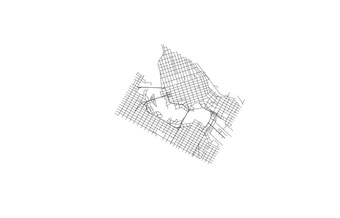

<!-- Generated from vignettes.orig/canstreet.Rmd -- do not edit. -->
<!-- Rebuild with: Rscript vignettes.orig/precompute.R -->


This vignette is precomputed --- it downloads several hundred megabytes --- but
the code is what you would run.


``` r
library(canstreet)
library(dplyr)
```

## Set a cache path

A national vintage is 200–350 MB compressed and about 2.2 million segments, so
`canstreet` caches the archives and the harmonized database. Set a directory
once and it applies to every session:


``` r
set_canstreet_cache_path("~/data/canstreet", install = TRUE)
```

Without one everything goes to `tempdir()`. `show_canstreet_cache_path()`
reports what is in effect.

## What is available


``` r
list_road_network_vintages() |>
  select(vintage, product, coverage, source_crs, imported)
#> # A tibble: 26 × 5
#>    vintage product coverage source_crs imported
#>      <int> <chr>   <chr>    <chr>      <lgl>   
#>  1    1976 AMF     bc-urban EPSG:4267  TRUE    
#>  2    1981 AMF     bc-urban EPSG:4267  TRUE    
#>  3    1991 SNF     urban    EPSG:4267  TRUE    
#>  4    1996 SNF     urban    EPSG:4267  TRUE    
#>  5    2001 RNF     national EPSG:4269  TRUE    
#>  6    2005 RNF     national EPSG:4269  FALSE   
#>  7    2006 RNF     national EPSG:4269  TRUE    
#>  8    2007 RNF     national EPSG:4269  FALSE   
#>  9    2008 RNF     national EPSG:4269  FALSE   
#> 10    2009 RNF     national EPSG:4269  FALSE   
#> # ℹ 16 more rows
```

The 1991 and 1996 Street Network Files cover urban areas only; everything from
2001 on is national.

## Getting a vintage

The first call downloads and imports; after that it is instant.


``` r
roads <- get_road_network(2021)
roads
#> # A query:  ?? x 24
#> # Database: DuckDB 1.5.4 [jens@Darwin 25.6.0:R 4.6.0//Users/jens/data/canstreet/canstreet.duckdb]
#>    vintage source_file source_id name  type  dir    af_l  at_l  af_r  at_r class
#>      <int> <chr>       <chr>     <chr> <chr> <chr> <int> <int> <int> <int> <fct>
#>  1    2021 lrnf000r21… 5792582   des … RANG  <NA>    195   195   182   194 Local
#>  2    2021 lrnf000r21… 4744971   Town… <NA>  <NA>     NA    NA    NA    NA Coll…
#>  3    2021 lrnf000r21… 1935694   733 … RD    <NA>     NA    NA    NA    NA Local
#>  4    2021 lrnf000r21… 1618738   <NA>  <NA>  <NA>     NA    NA    NA    NA Local
#>  5    2021 lrnf000r21… 5055161   Maple ST    <NA>     NA    NA    NA    NA Local
#>  6    2021 lrnf000r21… 5483228   de H… RUE   <NA>    589   631   580   666 Local
#>  7    2021 lrnf000r21… 5469451   Fors… RUE   <NA>  12485 12535 12496 12508 Local
#>  8    2021 lrnf000r21… 1591874   Vict… ST    S        39    49    NA    NA Coll…
#>  9    2021 lrnf000r21… 712595    de l… RUE   <NA>    215   223   216   222 Local
#> 10    2021 lrnf000r21… 3324319   Soup… RUE   <NA>     NA    NA    NA    NA Local
#> # ℹ more rows
#> # ℹ 13 more variables: rank <fct>, csduid_l <chr>, csduid_r <chr>,
#> #   csdname_l <chr>, csdname_r <chr>, csdtype_l <chr>, csdtype_r <chr>,
#> #   cmauid_l <chr>, cmauid_r <chr>, pruid_l <chr>, pruid_r <chr>, len_m <dbl>,
#> #   geom <list>
```

The result is a lazy table over DuckDB, so this aggregation over 2.2 million
segments runs in the database and only the answer comes back:


``` r
roads |>
  filter(!is.na(pruid_l)) |>
  group_by(pruid_l) |>
  summarize(segments = n(), km = round(sum(len_m, na.rm = TRUE) / 1000)) |>
  arrange(desc(km)) |>
  collect()
#> # A tibble: 13 × 3
#>    pruid_l segments     km
#>    <chr>      <dbl>  <dbl>
#>  1 47        223061 237403
#>  2 35        570216 229710
#>  3 48        369662 214914
#>  4 24        446796 148103
#>  5 59        277390 125007
#>  6 46        125256  96426
#>  7 12         77424  38538
#>  8 13         67096  32229
#>  9 10         54109  24947
#> 10 60          5712   8849
#> 11 11         16415   6941
#> 12 61          5751   6234
#> 13 62          3227    864
```

## Spatial filters

Pass any `sf`, `sfc` or `bbox` object as `within`. Over a single vintage the
filter uses that vintage's R-tree index, so it stays fast on a national file.
`collect_road_network()` then materializes the result as `sf`.


``` r
bbox <- sf::st_bbox(c(xmin = -123.15, ymin = 49.26, xmax = -123.09,
                      ymax = 49.29), crs = 4326)

downtown <- get_road_network(2021, within = bbox) |>
  collect_road_network()

downtown |> select(name, type, af_l, at_l, csdname_l)
#> Simple feature collection with 2099 features and 5 fields
#> Geometry type: LINESTRING
#> Dimension:     XY
#> Bounding box:  xmin: 4015724 ymin: 2004073 xmax: 4021033 ymax: 2008953
#> Projected CRS: NAD83 / Statistics Canada Lambert
#> # A tibble: 2,099 × 6
#>    name          type   af_l  at_l csdname_l                                geom
#>    <chr>         <chr> <int> <int> <chr>                        <LINESTRING [m]>
#>  1 11th          AVE     605   675 Vancouver  (4019577 2004160, 4019699 2004093)
#>  2 Carolina      ST     2706  2724 Vancouver (4019577 2004160, 4019553 2004116,…
#>  3 Carolina      ST     2640  2640 Vancouver (4019624 2004244, 4019602 2004204,…
#>  4 11th          AVE     501   599 Vancouver  (4019453 2004229, 4019577 2004160)
#>  5 10th          AVE     571   657 Vancouver  (4019624 2004244, 4019745 2004178)
#>  6 St. George    ST     2710  2750 Vancouver (4019453 2004229, 4019428 2004184,…
#>  7 11th          AVE     401   435 Vancouver  (4019253 2004339, 4019329 2004297)
#>  8 Carolina      ST     2520  2638 Vancouver (4019677 2004341, 4019649 2004290,…
#>  9 Prince Edward ST     2650  2698 Vancouver  (4019274 2004374, 4019253 2004339)
#> 10 Broadway      <NA>    601   699 Vancouver  (4019677 2004341, 4019799 2004274)
#> # ℹ 2,089 more rows
```


``` r
plot(sf::st_geometry(downtown), col = "grey30", lwd = 0.6)
```

<div class="figure">

<p class="caption">plot of chunk plot</p>
</div>

Geometry is stored in EPSG:3347 (NAD83 / Statistics Canada Lambert), so `len_m`
is metres for every vintage. `collect_road_network()` reprojects on request:


``` r
sf::st_crs(collect_road_network(get_road_network(2021, within = bbox),
                                crs = 4326))$epsg
#> [1] 4326
```

## Comparing vintages

Several years at once stack into one table:


``` r
get_road_network(c(1996, 2006, 2021)) |>
  group_by(vintage) |>
  summarize(segments = n(), km = round(sum(len_m, na.rm = TRUE) / 1000)) |>
  arrange(vintage) |>
  collect()
#> # A tibble: 3 × 3
#>   vintage segments      km
#>     <int>    <dbl>   <dbl>
#> 1    1996   629574  167238
#> 2    2006  1869564 1326099
#> 3    2021  2242117 1170167
```

1996 is urban areas only. The 2006–2021 drop is in the source data, not the
import: 2006 carries far more very long arcs, which later releases split,
reclassified or dropped.


``` r
get_road_network(c(2006, 2021)) |>
  filter(len_m > 5000) |>
  group_by(vintage) |>
  summarize(long_arcs = n(), km = round(sum(len_m, na.rm = TRUE) / 1000)) |>
  collect()
#> # A tibble: 2 × 3
#>   vintage long_arcs     km
#>     <int>     <dbl>  <dbl>
#> 1    2006     22486 206308
#> 2    2021     13055 120875
```

Identifiers are not documented as stable across vintages, so comparing years
means matching geometry. `build_temporal_network()` does that and writes one
table in which each segment carries the years it is present in --- see
`vignette("canstreet-temporal")`.

## The harmonized schema

Every vintage maps onto the same columns; one a vintage's files do not carry is
`NA` throughout it rather than absent, so the union stays legal.


``` r
canstreet_schema()
#> # A tibble: 24 × 3
#>    column      type    source_columns                         
#>    <chr>       <chr>   <chr>                                  
#>  1 vintage     INTEGER (reference year)                       
#>  2 source_file VARCHAR (name of the source archive member)    
#>  3 source_id   VARCHAR NGD_UID, NGDUID, NGD_ID, RB_UID, ARC_ID
#>  4 name        VARCHAR NAME                                   
#>  5 type        VARCHAR TYPE                                   
#>  6 dir         VARCHAR DIR, DIRECTION                         
#>  7 af_l        INTEGER AFL_VAL, ADDR_FM_LE, ADDR_FM_LEFT      
#>  8 at_l        INTEGER ATL_VAL, ADDR_TO_LE, ADDR_TO_LEFT      
#>  9 af_r        INTEGER AFR_VAL, ADDR_FM_RG, ADDR_FM_RGHT      
#> 10 at_r        INTEGER ATR_VAL, ADDR_TO_RG, ADDR_TO_RGHT      
#> # ℹ 14 more rows
```

Source spellings differ by vintage — `arc_id` in 1991/1996, `RB_UID` in
2001–2010, `NGD_UID` from 2011, `NGDUID` in 2016/2017 — and the importer
resolves each by alias, not by era.

## Exporting

`export_road_network()` writes GeoParquet with the CRS in its metadata, for use
from Python, QGIS or DuckDB:


``` r
get_road_network(2021, within = bbox) |>
  export_road_network("vancouver_2021.parquet")
```

## Managing the cache


``` r
list_canstreet_cache()
#> # A tibble: 9 × 6
#>   vintage n_segments n_archives raw_mb imported_at              package_version
#>     <int>      <int>      <int>  <dbl> <chr>                    <chr>          
#> 1    1976      60883          2    8.2 2026-08-30T14:29:39-0700 0.0.0.9000     
#> 2    1981     103774          2   10.2 2026-08-30T14:29:42-0700 0.0.0.9000     
#> 3    1991     599625         51   72.5 2026-08-29T12:49:40-0700 0.0.0.9000     
#> 4    1996     629574         50   70.5 2026-08-29T12:46:01-0700 0.0.0.9000     
#> 5    2001    2053112          1  250   2026-08-29T11:15:39-0700 0.0.0.9000     
#> 6    2006    1869564          1  219.  2026-08-28T18:57:14-0700 0.0.0.9000     
#> 7    2011    1973932          1  334.  2026-08-28T18:57:40-0700 0.0.0.9000     
#> 8    2016    2163058          1  327.  2026-08-28T18:58:07-0700 0.0.0.9000     
#> 9    2021    2242117          1  310.  2026-08-28T18:58:34-0700 0.0.0.9000
```

`remove_canstreet_cache(vintage)` drops a vintage's table and keeps its
archives, so it can be re-imported without downloading again; pass
`keep_raw = FALSE` to delete those too.

## Attribution

Source data are © Statistics Canada, distributed under the
[Statistics Canada Open Licence](https://www.statcan.gc.ca/en/reference/licence).
Cite the product and reference year in anything you publish from it.
